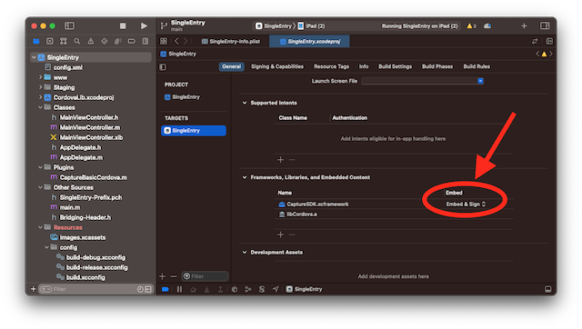
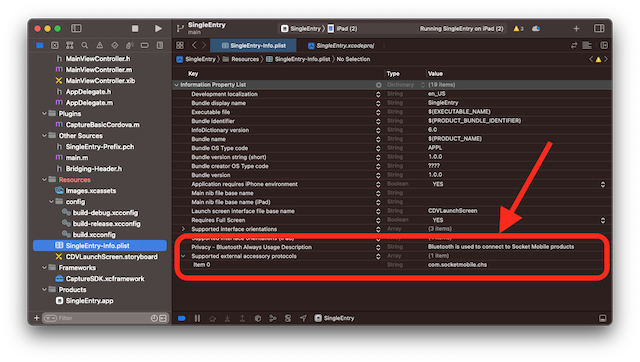

# Socket Mobile Capture Basic iOS Cordova Plugin

## Introduction

This Socket Mobile Capture Basic iOS Cordova plugin allows to use Socket Mobile barcode scanners with a Cordova application.

This Cordova plugin supports only iOS at this time.

**NOTE** This code is subject to change. This should be considered as beta.

**NOTE** This version requires a clone of this project and a clone of CaptureSDK Cocoapods.
Make sure to watch this repository to be notified when new updates are made available.

**NOTE** Most of Socket Mobile products are using Bluetooth Classic, but the NFC products (D600) and counter top products (S550, S370) are using BluetoothLE (Low Energy). Check the BluetoothLE paragraph for more information.

## Installation

Clone this repository:
`git clone git@github.com:SocketMobile/capturebasic-cordova-ios.git`

Update the Capture Basic Cordova plugin with the Capture SDK files:

```sh
$> cd capturebasic-cordova-ios
$> ./updateCaptureSdk.sh
```

Once the Capture Basic Cordova plugin has been updated with the CaptureSDK files then the plugin is now ready to be added to your Cordova application:

```sh
$> cordova plugin add /Users/me/documents/dev/github/capturebasic-cordova-ios
```

To remove the plugin from your Cordova application:

```sh
$> cordova plugin remove com-socketmobile-capturebasic-cordova
```

**IMPORTANT**
Make sure the CaptureSDK.xcframework is embedded and signed in the General settings of your project.




## Prequisites settings for the application

Since the CaptureSDK is using Bluetooth make sure the following items are in your info.plist of your application:

Supported External Protocol String should have an entry set to `com.socketmobile.chs`.

The Bluetooth Always Usage Description string should be set to describe to the end-user why we need the Bluetooth permission.



## Using the SDK in a Cordova application

This current version of the Capture SDK for Cordova is limited to notifications coming from the Socket Mobile barcode scanner.

If the code of your application is written using Typescript, you may want to declare the main object of the Capture Basic SDK as shown here:

```sh
declare let CaptureBasic: any;
```

The first thing is to set the callback function that will receive the Capture SDK events:

```sh
CaptureBasic.addListener('notifications', (success)=>{}, (error)=>{});
```

The success function should be modified to handle the various events coming from Capture such as `deviceArrival` when a scanner connects, `deviceRemoval` when the scanner disconnects and `decodedData` when the scanner reads a barcode.

------------------

**NOTE** This `CaptureBase.addListener()` should be invoked once the device is ready.

```javascript
// Wait for the deviceready event before using any of Cordova's device APIs.
// See https://cordova.apache.org/docs/en/latest/cordova/events/events.html#deviceready
document.addEventListener('deviceready', onDeviceReady, false);

```

------------------

Once the listener is setup then you need to register your application to Socket Mobile developer portal, by giving the app Bundle ID, your Socket Mobile developer ID and you'll retrieved a appKey.

The application is now ready to use Capture by calling this method:

```javascript
const appInfo = {
  appId: 'ios:com.socketmobile.tribeca',
  developerId: 'bb57d8e1-f911-47ba-b510-693be162686a',
  appKey: 'MC0CFGtbOAKfL/vF7EAXHDhg3SM6CUj5AhUArb8NDQPgMZ4V4uHHvLcla0lq5jI='
};

CaptureBasic.useCaptureBasic(appInfo,(success)=>{
      console.log('useCaptureBasic returns: ', success);
    },(error)=>{
      console.log('useCaptureBasic returns an error: ', error);
    });
```

Adding the listener could look like this:

```javascript
CaptureBasic.addListener('notifications', (success)=>{
  const notification = JSON.parse(success);
  if (notification.name === 'initializeComplete') {
    console.log('Capture initialization completed');
  }
  else if (notification.name === 'deviceArrival'){
    console.log('device arrival: ', notification.deviceName);
  }
  else if (notification.name === 'deviceRemoval'){
    console.log('no device connected');
  }
  else if (notification.name === 'decodedData') {
    const decodedData = notification.decodedData.map(c => String.fromCharCode(c)).join('');
    console.log('decodedData: ', decodedData);
  }
},(error)=>{
  console.log('notification error: ', error);
});
```

## Get/Set property

It is possible to get information from a connected scanner or to change the value of a device property by using the Set/Get property API.

The typical result when the get or set property returns is something similar to this:

```javascript
{
  "propId" : 65803,
  "propType" : 3,
  "value" : 1677744640,
  "handle" : "10742802912"
}
```

### Example: Get Device Battery Level

Here is an example of getting the battery level of a connected device:

```javascript
function getBatteryLevel() {
    console.log('click on getBatteryLevel');
    const property = {
        handle: deviceHandle, // device from which we want battery level
        propId: 65803, // battery level
        propType: 0, // None
    };
    CaptureBasic.getProperty(property, success => {
        console.log('getProperty success: ', success);
        // the value is actually organized like this:
        // MSB                        LSB
        // ------------------------------
        // |  0   | Max | Current | Min |
        // ------------------------------  
        const response = JSON.parse(success);
        const percent = (parseInt(response.value, 10) & 0xffff) >> 8;
        console.log(`Battery is at ${percent}%`);
    }, error => {
        console.log('getProperty error: ', error);
    })
}
```

## Possible events received from Capture

### Device Arrival

Each time a scanner is connected and ready to be used then the device arrival event is generated to let the application know a new scanner is ready.

This event contains the information about the scanner such as its type and the friendly name associated to the scanner.
The device handle identifies the scanner in a unique fashion and changes each time the scanner connects.

Here is the json data received in the Capture callback:

```javascript
{
  "deviceHandle": "10787750208",
  "deviceType": 196619,
  "name": "deviceArrival",
  "type": "deviceType",
  "deviceName": "Socket D740 [E537BA]"
}
```

### Device Removal

The device removal event occurs each time the scanner disconnects from the host.
It holds the information about the scanner that has just disconnected.

```javascript
{
  "deviceType": 196619,
  "deviceHandle": "10787750208",
  "name": "deviceRemoval",
  "type": "deviceType",
  "deviceName": "Socket D740 [E537BA]"
}
```

### Decoded Data

Each time the scanner successfully scans a barcode, the decoded data event is generated holding the decoded data, the symbology ID and the symbology name as well as the scanner information from which the decoded data came from.

```javascript
{
  "deviceHandle": "10787750208",
  "decodedData": [
    65,
    55,
    51,
    54,
    55,
    79,
    48,
    51,
    79,
    68
  ],
  "deviceName": "Socket D740 [E537BA]",
  "deviceType": 196619,
  "dataSourceId": 11,
  "dataSourceName": "Code 39",
  "type": "decodedData",
  "name": "decodedData"
}
```

If the type of the decoded data is UTF8 based a simple conversion can reformat the decoded data as a string like this:

```javascript
if (event.name === 'decodedData') {
  const decodedData = event.decodedData.map(c => String.fromCharCode(c)).join('');
  console.log('decodedData: ', decodedData);
}
```

### Capture initialize Complete

When Capture is initialized for the first time, an event is generated to confirm the result of the initialization.

```javascript
{
  "name": "initializeComplete",
  "type": "result",
  "result": 0
}
```

### Capture Terminated

When ScanAPI is shutting down, a terminate event is sent to indicate to the application that it won't receive anymore notifications from Capture.

```javascript
{
  "name" : "captureBasicTerminated"
  "type": "result",
  "result": 0
}
```

### Error

If an error occurs, Capture will send an event that includes the error code.

```javascript
{
  "type" : "error",
  "name" : "onError",
  "result" : -27
}
```

## BluetoothLE products, mostly NFC Reader/Writer (D600, S550, S370)

The BluetoothLE uses a Bluetooth Manager with a concept of Favorite.

If the Favorite is set to an empty string (default), CaptureSDK won't discover any BluetoothLE devices. If it will discover only Bluetooth Classic devices.

If the Favorite is set with one \* (wildchar) then it will discover and connect to ONE BluetoothLE Socket product. If the Favorite is set with 2 \* (wildchar) it will discover and connect to 2 BluetoothLE Socket products.

Here is an example of setting the Bluetooth Manager favorite

```javascript
function onDeviceReady() {
    // Cordova is now initialized. Have fun!
    CaptureBasic.addListener('notifications', (success)=>{
        console.log('Capture received: ', success);
        const result = JSON.parse(success);
        if(result.name === 'deviceArrival'){
            console.log('got a device arrival, ask for battery level');
            .../...
        }
        else if(result.name === 'deviceManagerArrival'){
            console.log('got a device manager arrival, set the favorite to discover BLE devices');
            deviceHandle = result.deviceHandle;
            const property = {
                handle: deviceHandle,
                propId: 328193, // Favorite
                propType: 5, // argument string
                value: '*' // any Socket Mobile BLE
            };
            CaptureBasic.setProperty(property, success => {
                console.log('setProperty success: ', success);
            }, error => {
                console.log('setProperty error: ', error);
            })
        }
```

Once the Device Manager favorite is set, the BluetoothLE Socket Mobile product will connects as soon as it is turned on. The Capture Basic will send a notification if the device connects or disconnects like any other Socket Mobile products.


